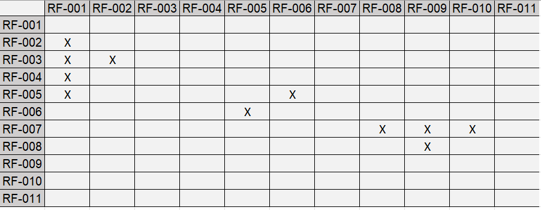
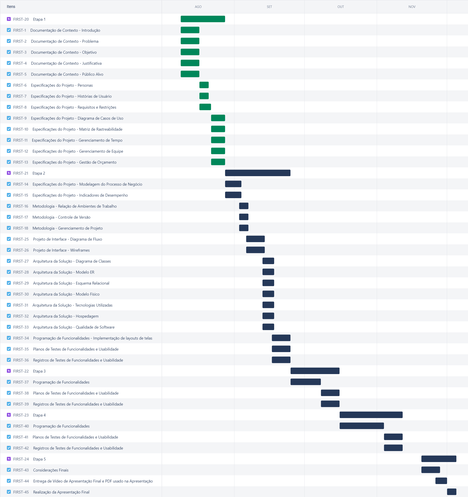

# Especificações do Projeto

Pré-requisitos: <a href="1-Documentação de Contexto.md"> Documentação de Contexto</a>

Definição do problema e ideia de solução a partir da perspectiva do usuário. É composta pela definição do  diagrama de personas, histórias de usuários, requisitos funcionais e não funcionais além das restrições do projeto.

Apresente uma visão geral do que será abordado nesta parte do documento, enumerando as técnicas e/ou ferramentas utilizadas para realizar a especificações do projeto

## Personas

**1. Usuário Casual - Maria Eugênia**
- Idade: 29 anos
- Profissão: Bancária
- Experiência Tecnológica: Moderada
- Motivação: Maria Eugênia que um aplicativo de fácil utilização para acompanhamento dos seus pedidos online. Ela valoriza a praticidade e a conveniência.

**2. Usuário Idoso: Antônio**
- Idade: 68 anos
- Profissão: Aposentado
- Experiência Tecnológica: Básica
- Motivação: Antônio que utilizar o aplicativo para acompanhar seus pedidos de forma mais eficiente, mas necessita de um interface bastante intuitiva, simples e clara.

**3. Usuário Focado: Marcela**
- Idade: 37 anos
- Profissão: Arquiteta
- Experiência Tecnológica: Alta
- Motivação: Marcela precisa acompanhar seus pedidos realizados para sua equipe de trabalho. Ela procura um aplicativo que ofereça atualizações detalhadas e, de preferência, em tempo real do status de seu pedido.

## Histórias de Usuários

Com base na análise das personas foram identificadas as seguintes histórias de usuários:

**1. História de Usuário de Maria Eugênia - Acompanhamento Simplificado:**

- Como Maria Eugênia, gostaria de realizar o login no aplicativo através do meu e-mail e senha para acessar meus pedidos anteriores.

- Após realizado o login, gostaria de visualizar uma lista com meus pedidos recentes e suas informações básicas, como datas e status.

**2. História de Usuário de Antônio - Experiência Amigável para Idosos:**

* Como João, gostaria de criar uma conta no aplicativo de forma simples, fornecendo somente informações essenciais.
  
* Ao realizar o login, gostaria de visualizar uma tela inicial simples com botões grandes e legíveis para acessar meus pedidos e outras funcionalidades.

**3. História de Usuário de Marcela - Acompanhamento Detalhado:**

- Como Marcela, gostaria de realizar o login de maneira rápida no aplicativo, fornecendo apenas informações essenciais e que estas pudessem ficar salvas, agilizando o próximo acesso.
- Ao entrar no aplicativo, gostaria de visualizar meus pedidos recentes em destaque, com informações detalhadas, como produtos específicos e seus status. 

**4. História de Usuário de Todos - Fale Conosco:**

- Como um usuário, gostaria de poder entrar em contato com o suporte do aplicativo.
- Na tela de "Fale Conosco", quero ter a opção de preencher um formulário ou iniciar uma conversa via whatsapp para relatar problemas ou realizar perguntas.

**5. História de Usuário Marcela - Atualizações em Tempo Real:**

- Como Marcela, gostaria de receber notificações push sempre que houver uma atualização no status de um pedido.
- Gostaria também de poder visualizar as atualizações em tempo real na tela de detalhamento do pedido.

**6. História de Usuário Maria Eugênia - Atualização de Perfil:**

- Como Maria Eugênia, gostaria de atualizar minha foto de perfil e informações de contato quando necessário.
- Na tela de perfil, gostaria de ter a opção de editar e salvar essas informações atualizadas.

## Modelagem do Processo de Negócio 

### Análise da Situação Atual

O processo atual se esbarra em dificuldades que trazem à tona a ausência de uma aplicação que possa automatizar processos gerenciais na empresa, como : cadastro de usuário, checar pedidos, buscar suporte.

### Descrição Geral da Proposta

A aplicação móvel em desenvolvimento pretende corrigir tal situação por meio de funcionalidades que visam o conforto e a autonomia do usuário em poder acessar e manusear processos que vão ajudar na gerencia da empresa e trazer comodidade para o fornecedor e pedinte.
### Processo 1 – Fluxo da aplicação

## Indicadores de Desempenho

|  Idnicador  | Descrição|Calculo|Fonte de dados| Perspectiva|
|-------------|----------|-------|--------------|------------|
| Usuários cadastrados| Levantamento total usuários| Média mensal | Levantamento total de usuários |  Crescimento na quantidade de novos cadastros | 
| Contato de suporte| Quantidade de usuários que contatam o suporte e suas necessidades | Levantamento mensal| Planilia de chamado | Avaliar as requisições de suporte a fim implementar possíveis melhorias  |
| Taxa de retenção de usuário|  Porcentagem de usuários que retornam ao aplicativo após a primeira interação. |Levantamento mensal|Levantamento total de usuários ativos |Analisar o valor que a aplicação tem para o usuário|
| Avaliação do cliente |Coletar feedback dos clientes| Média de avaliações| Classificações e comentários| Medir a satisfação do cliente e identificar áreas que precisam de melhorias |
|Média de pedidos | Quantificar os pedidos feitos|Média mensal|Levantamento mensal|Ajuda a avaliar o desempenho geral dos pedidos|

## Requisitos

As tabelas que se seguem apresentam os requisitos funcionais e não funcionais que detalham o escopo do projeto. Para determinar a prioridade de requisitos, aplicar uma técnica de priorização de requisitos e detalhar como a técnica foi aplicada.

### Requisitos Funcionais

|ID    | Descrição do Requisito  | Prioridade |
|------|-----------------------------------------|----|
|RF-001| Permitir que novos usuários se cadastrem fornecendo informações como nome, e-mail, senha, e possivelmente outros detalhes relevantes. | ALTA | 
|RF-002| Permitir que os usuários façam login usando suas credenciais (nome de usuário ou e-mail e senha). | ALTA | 
|RF-003| Validar as credenciais e conceder acesso ao aplicativo após a autenticação bem-sucedida.   | ALTA |
|RF-004| Validar os dados inseridos para garantir a integridade das informações.  | MÉDIA |
|RF-005| Exibir as informações do perfil do usuário, como nome, imagem de perfil e detalhes de contato.   | MÉDIA |
|RF-006| Permitir que os usuários atualizem suas informações de perfil, se necessário.   | MÉDIA |
|RF-007| Mostrar uma lista dos pedidos feitos pelo usuário, exibindo detalhes básicos de cada pedido.   | ALTA |
|RF-008| Permitir a seleção de um pedido para acessar a tela de detalhamento.   | MÉDIA |
|RF-009| Exibir informações completas sobre um pedido específico, incluindo produtos, status do pedido, data de criação etc.   | MÉDIA |

### Requisitos não Funcionais

|ID     | Descrição do Requisito  |Prioridade |
|-------|-------------------------|----|
|RNF-001| O sistema deve ser responsivo para rodar em um dispositivos móvel | ALTA | 
|RNF-002| Prevenir acessos não autorizados usando autenticação adequada e mecanismos de autorização. |  ALTA |
|RNF-003| Manter alta disponibilidade do serviço para que os usuários possam acessar e interagir com o aplicativo a qualquer momento, exceto durante manutenções planejadas. |  MÉDIA | 
|RNF-004| A aplicação deve ser compatível com sistemas Android. |  MÉDIA | 

## Restrições

O projeto está restrito pelos itens apresentados na tabela a seguir.

|ID| Restrição                                             |
|--|-------------------------------------------------------|
|01| O projeto deverá ser entregue até o final do semestre letivo, não podendo extrapolar a data de 04/12/2023 |
|02| O aplicativo deve se restringir às tecnologias de desenvolvimento mobile.       |
|03| 	A equipe não pode subcontratar o desenvolvimento do trabalho.      |

## Diagrama de Casos de Uso

O diagrama de casos de uso é o próximo passo após a elicitação de requisitos, que utiliza um modelo gráfico e uma tabela com as descrições sucintas dos casos de uso e dos atores. Ele contempla a fronteira do sistema e o detalhamento dos requisitos funcionais com a indicação dos atores, casos de uso e seus relacionamentos. 

 

# Matriz de Rastreabilidade

A matriz de rastreabilidade é uma ferramenta usada para facilitar a visualização dos relacionamento entre requisitos e outros artefatos ou objetos, permitindo a rastreabilidade entre os requisitos e os objetivos de negócio. 

# Gerenciamento de Projeto

De acordo com o PMBoK v6 as dez áreas que constituem os pilares para gerenciar projetos, e que caracterizam a multidisciplinaridade envolvida, são: Integração, Escopo, Cronograma (Tempo), Custos, Qualidade, Recursos, Comunicações, Riscos, Aquisições, Partes Interessadas. Para desenvolver projetos um profissional deve se preocupar em gerenciar todas essas dez áreas. Elas se complementam e se relacionam, de tal forma que não se deve apenas examinar uma área de forma estanque. É preciso considerar, por exemplo, que as áreas de Escopo, Cronograma e Custos estão muito relacionadas. Assim, se eu amplio o escopo de um projeto eu posso afetar seu cronograma e seus custos.

## Gerenciamento de Tempo

Com diagramas bem organizados que permitem gerenciar o tempo nos projetos, o gerente de projetos agenda e coordena tarefas dentro de um projeto para estimar o tempo necessário de conclusão.

O gráfico de Gantt ou diagrama de Gantt também é uma ferramenta visual utilizada para controlar e gerenciar o cronograma de atividades de um projeto. Com ele, é possível listar tudo que precisa ser feito para colocar o projeto em prática, dividir em atividades e estimar o tempo necessário para executá-las.

 

## Gerenciamento de Equipe

O gerenciamento adequado de tarefas contribuirá para que o projeto alcance altos níveis de produtividade. Por isso, é fundamental que ocorra a gestão de tarefas e de pessoas, de modo que os times envolvidos no projeto possam ser facilmente gerenciados. 

## Gestão de Orçamento

O processo de determinar o orçamento do projeto é uma tarefa que depende, além dos produtos (saídas) dos processos anteriores do gerenciamento de custos, também de produtos oferecidos por outros processos de gerenciamento, como o escopo e o tempo.

| Item                    | Descrição                                     | Custo Estimado (R$) |
|-------------------------|-----------------------------------------------|---------------------|
| **Equipe**              |                                               |                     |
| Gerente de Projeto      | Salário mensal (6 meses)                     | 60.690,00           |
| Designer de UI/UX       | Salário mensal (3 meses)                     | 13.595,00           |
| Desenvolvedores (2)     | Salário mensal (6 meses)                     | 84.000,00           |
| QA Testers (2)          | Salário mensal (4 meses)                     | 40.000,00           |
| **Total da Equipe**     |                                               | 198.285,00          |
| **Tecnologia**          |                                               |                     |
| Computadores e Hardware | Equipamento para a equipe                    | 40.000,00           |
| Licenças de Software    | Ferramentas de desenvolvimento e design      | 7.000,00           |
| Infraestrutura em Nuvem | Serviços de hospedagem e armazenamento       | 15.000,00           |
| **Total Tecnológico**   |                                               | 62.000,00           |
| **Reserva para Contingências** |                                        | 19.500,00           |
| **Total Estimado**      |                                               | **279.785,00**     |
